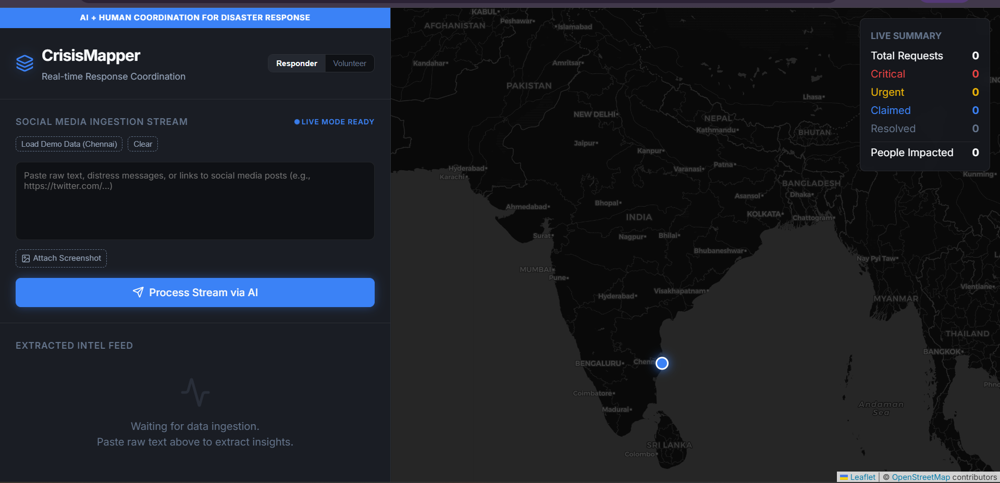
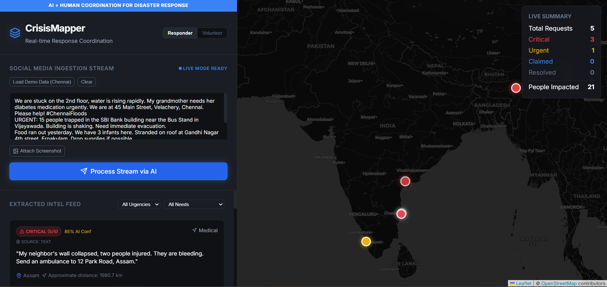
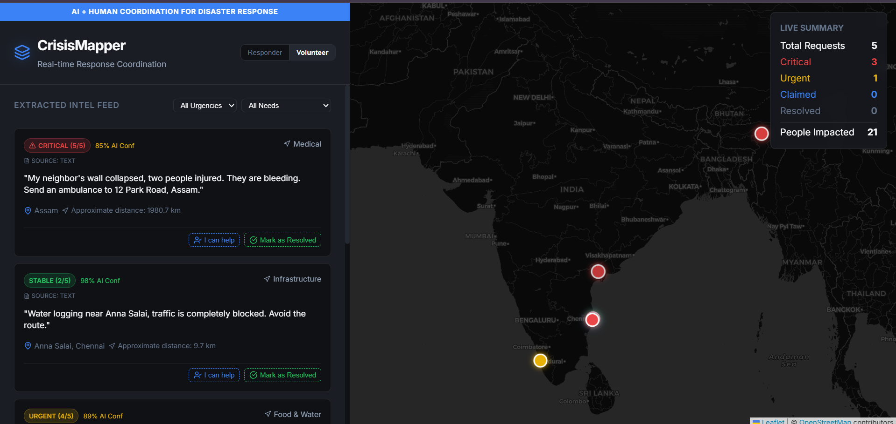

# 🚨 CrisisMapper

### AI + Human Coordination for Disaster Response

---

## 🧠 Problem
During disasters (floods, cyclones, earthquakes), thousands of people post rescue requests on social media.  
However, emergency responders cannot process this information in real time.

👉 Critical signals get lost in noise → delayed response → lives at risk

---

## 💡 Solution
CrisisMapper converts unstructured social media data into structured, actionable intelligence and visualizes it on a live map.

It enables both:
- 🏢 Responders to prioritize rescue efforts  
- 🙋 Volunteers to actively participate in helping  

---

## ⚙️ How It Works
1. Input:
   - Social media text  
   - Screenshots  
   - Links  

2. AI Processing:
   - Extracts:
     - 📍 Location  
     - 🚨 Urgency level  
     - 🆘 Type of need  

3. Output:
   - Structured data  
   - Real-time map visualization  

---

## 🚀 Key Features
- Real-time disaster data processing  
- Multilingual support (English, Hindi, Telugu)  
- Confidence scoring (AI reliability)  
- Screenshot & link ingestion  
- Volunteer mode ("I can help")  
- Claim & resolve system  
- Filtering by urgency & need type  

---

## 🤝 Volunteer Mode
Citizens in safe areas can:
- View nearby requests  
- Identify unassigned cases  
- Click **“I can help”**  

👉 Prevents duplication and improves coordination  

---

## 🛠 Tech Stack
- Frontend: React (Vite)  
- Map: Leaflet.js  
- Backend: Node.js (mocked)  
- AI: LLM / simulated extraction  

📸 Demo

---

## 📊 Impact
- Faster rescue response  
- Better resource allocation  
- Community-driven disaster support  

---

## 🎯 Future Scope
- Real-time API integration (Twitter, etc.)  
- Verification systems  
- Predictive disaster analytics  

---

## 🏁 Conclusion
> “In disasters, minutes matter.  
> CrisisMapper transforms information into coordinated action.”